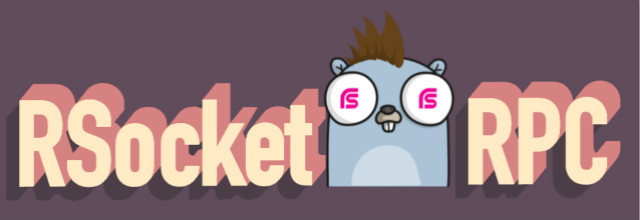

# rsocket-rpc-go


[]((https://img.shields.io/travis/rsocket/rsocket-rpc-go.svg))
[](https://godoc.org/github.com/rsocket/rsocket-rpc-go)
[](https://goreportcard.com/report/github.com/rsocket/rsocket-rpc-go)
[](https://github.com/rsocket/rsocket-rpc-go/blob/master/LICENSE)
[](https://github.com/rsocket/rsocket-rpc-go/releases)

## NOTICE
It is still under development. **DO NOT USE IT IN A PRODUCTION ENVIRONMENT!!!**

## Install
1. Install Protocol Buffers v3. Please see [https://github.com/protocolbuffers/protobuf](https://github.com/protocolbuffers/protobuf).
2. We offer a `protoc-gen-go` with RSocket RPC support and it's 100% compatible with [official tools](https://github.com/golang/protobuf).
Please install by command below:

```bash
$ go get -u github.com/rsocket/rsocket-rpc-go/protoc-gen-go
```

## Generate Codes
If you are familiar with grpc, just replace the `grpc` with `rrpc`:
```bash
$ protoc --go_out=plugins=rrpc:./ping-pong ./ping-pong.proto
```

> NOTICE: you can find some sample codes in [examples](./examples)
